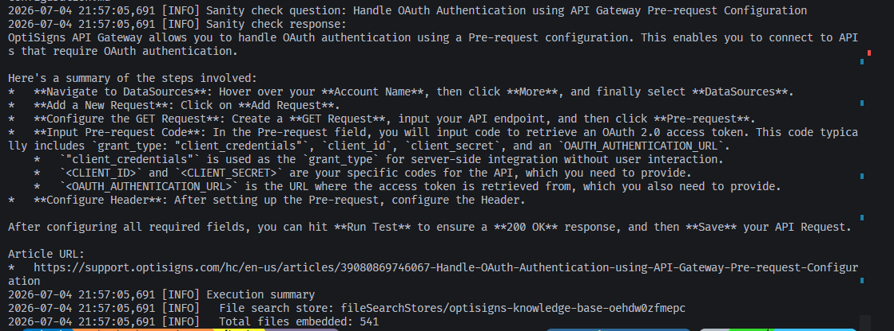

# 0Ᵽti⟆igns Support Article Pipeline

Automated pipeline that scrapes OptiSigns Zendesk help articles, converts them to Markdown, and ingests them into a Gemini File Search Store powering **OptiBot** — a RAG-based customer-support assistant.

---

## Project Overview & File Summary

**Architecture:** TypeScript scraper (`Scrape/`) feeds Markdown into a Python ingestion layer (`AIAssistant/`) that syncs documents to a Gemini File Search Store via delta detection. A single Docker image ships both runtimes.

| File | Role |
|---|---|
| `Scrape/src/api.ts` | Fetches one page of articles from the Zendesk Help Center API (`BASE_URL` + `ZENDESK_API`). Returns typed `Article[]`. |
| `Scrape/src/migrate.ts` | Converts each article's HTML body to Markdown via Turndown (ATX headings, fenced code, custom rules to demote `h4` -> h3 and strip empty anchors), writes YAML frontmatter + slugified filename to `Scrape/src/dist_markdown/`. Resolves internal Zendesk URLs to local `<slug>.md` paths. |
| `AIAssistant/src/config.py` | Loads `.env`, exposes all tunables: `GEMINI_API_KEY`, `GEMINI_MODEL` (`gemini-2.5-flash`), `MARKDOWN_SOURCE_DIR`, `MANIFEST_PATH`, `RUN_SCRAPER`, `SCRAPER_TIMEOUT_SECONDS`. |
| `AIAssistant/src/client.py` | Singleton `google.genai.Client` initialized at import time; calls `validate_config()` to guard against missing key. |
| `AIAssistant/src/delta.py` | SHA-256 hashes every `.md` file, compares against `manifest.json`, and classifies files as `added / updated / unchanged / deleted`. Writes the manifest atomically via a `.tmp` swap. |
| `AIAssistant/src/store_manager.py` | Creates or reuses the Gemini File Search Store (`OptiSigns Knowledge Base`). Uploads Markdown files with polling until the async operation completes (3 attempts, 5 s back-off). Deletes stale documents. Exposes store metrics. |
| `AIAssistant/src/scraper_runner.py` | Wipes `dist_markdown/` then shells out `pnpm run migrate` (cwd=`Scrape/`) with a configurable timeout. Raises on non-zero exit or `pnpm` not found. |
| `AIAssistant/src/assistant.py` | Builds a `GenerateContentConfig` with `system_prompt.md` as `system_instruction` and the File Search Store attached as a `FileSearch` tool. Calls `gemini-2.5-flash` and returns the raw response. |
| `AIAssistant/src/citations.py` | Post-processes the response: walks `grounding_metadata.grounding_chunks`, looks up each cited file in `dist_markdown/` to extract its `Article URL:` frontmatter line, appends up to 3 `Article URL:` citation lines to the reply body. |
| `AIAssistant/main.py` | Orchestrates the full pipeline: clean -> scrape -> delta -> delete stale -> upload delta -> save manifest. Exits 0 on full success, 1 on any failure. |
| `AIAssistant/check_store.py` | One-shot diagnostic: prints store metrics then runs the hardcoded sanity-check question `"How do I add a YouTube video?"` against the live store. |
| `AIAssistant/query.py` | CLI wrapper: accepts `store_name` and `question` as positional args, prints the formatted response with citations. |
| `AIAssistant/system_prompt.md` | OptiBot persona: helpful, factual, concise; answers only from uploaded docs; max 5 bullet points; cite up to 3 `Article URL:` lines per reply. |
| `AIAssistant/manifest.json` | Persisted state: `store_name`, `last_run` timestamp, per-file SHA-256 hash + Gemini document resource name. Survives runs to enable incremental sync. |

---

## Setup Instructions

**Prerequisites:** Python 3.12+, Node.js 20.x, pnpm 10.33.0 (`corepack enable && corepack prepare pnpm@10.33.0 --activate`)

**Scraper environment** — create `Scrape/.env`:
*view env.sample

**AIAssistant environment** — create `AIAssistant/.env`:
```
GEMINI_API_KEY=your_gemini_api_key_here

# Optional overrides (defaults shown)
# MANIFEST_PATH=/data/manifest.json   # use a mounted volume in production
# RUN_SCRAPER=true
# SCRAPER_TIMEOUT_SECONDS=600
# SCRAPE_DIR=../Scrape
```

---

## How to Run Locally

```bash
# 1. Install Node dependencies (scraper layer)
cd Scrape && pnpm install

# 2. Set up Python virtual environment (AIAssistant layer)
cd ../AIAssistant
python -m venv venv
venv\Scripts\activate           # Windows
source venv/Scripts/activate    # Git Bash / WSL
pip install -r requirements.txt

# 3. Run the full pipeline (scrape -> delta detect -> ingest)
python main.py

# 4. Verify store health + run sanity check
python check_store.py

# 5. Ad-hoc query
python query.py fileSearchStores/optisigns-knowledge-base-oehdw0zfmepc "How do I add a YouTube video?"

# Skip scraping (reuse existing dist_markdown):
$env:RUN_SCRAPER="false"; python main.py
```

---

## Production Deployment & Automation

Deployed as a Docker container (Python 3.12-slim + Node.js 20 + pnpm 10.33.0) on Railway. The daily automated job runs `python main.py` on a cron schedule.

**Last run artifacts / job logs:**
https://railway.com/project/a7f0b5b7-2680-440e-99d4-be0f1784c4fe/service/62e84058-e0f2-4ffc-ada0-b5ee5b2b8376?environmentId=463967e5-4615-43dc-8412-44cd694fa069

> Override `MANIFEST_PATH` to a mounted volume (e.g. `/data/manifest.json`) so incremental state persists across ephemeral job runs.

---

## Verification (Sanity Check)

Run `python check_store.py` to fire the hardcoded question **"How do I add a YouTube video?"** against the live store.

Expected response shape (enforced by `system_prompt.md`):
- Maximum 5 bullet points
- Up to 3 trailing `Article URL:` citation lines

> **Screenshot:** 
